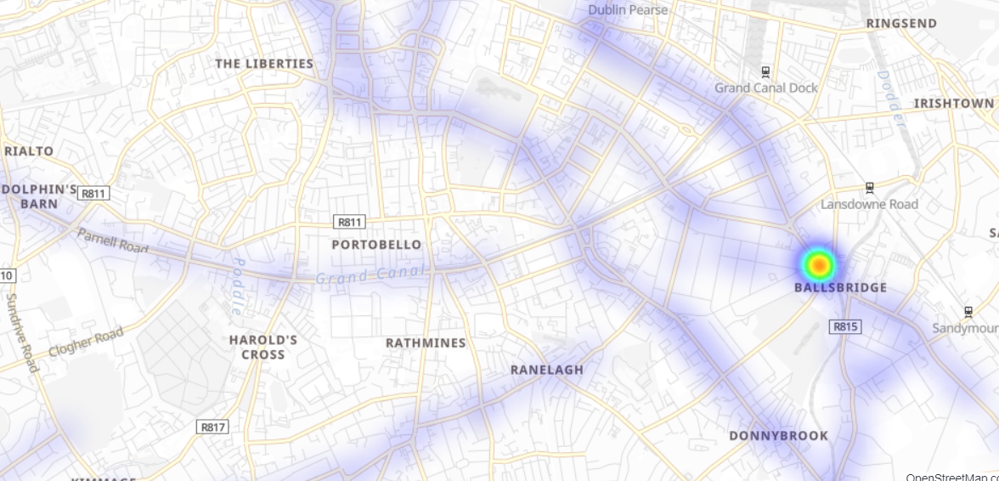

= Dublin Bus Analyzer
Shahar Rotem; Afik Bar
//settings
:idprefix:
:idseparator: -
:source-language: ruby
:language: {source-language}
ifndef::env-github[:icons: font]
ifdef::env-github[]
:status:
:outfilesuffix: .adoc
:caution-caption: :fire:
:important-caption: :exclamation:
:note-caption: :paperclip:
:tip-caption: :bulb:
:warning-caption: :warning:
endif::[]

Dublin Bus Analyzer is  a _real-time_ public transportation analyzer in Dublin, Ireland.

To access the application, visit http://glacial-sands-26484.herokuapp.com/[Home]. +
To access _real-time_ live map, navigate to http://glacial-sands-26484.herokuapp.com/map[Map]. +
To upload new data, navigate to http://glacial-sands-26484.herokuapp.com/upload[Upload].

== The Big Picture

We propose a _real-time_ system, that process sensory data from buses, and attempts to correct uncertainty, based on location & partitioning feature (for instance, line number).

We've used `230 million` records from bus sensors within Dublin,
between July 2017 to September 2018, as a warm-start.

== Problem Definition
It is very common to encounter uncertainty when around sensory data.

From our data exploration process, we've discovered what we believe is a key-stone uncertainty issue - the reported station number and\or reported driving phase (at-stop: yes\no) is not accurate, as seen in the following heat-map.

.Bus Stop 415 Heatmap

This uncertainty affect many future analysis to be performed with the data (i.e. when the bus will arrive, delay prediction, anomaly detection etc.).

== Technologies
* _Apache Spark_(TM) as processing framework.
* All the data is loaded onto _Elasticsearch_ pass:[&#x1f499;] cluster.

== Requirements

=== Web App
The web-app is currently deployed http://glacial-sands-26484.herokuapp.com/[here] (using Heroku).

to manually deploy, Python 3.5+ is required, please install neccesary packages using: `pip install -r requirement.txt`.

then simply run: `python dublin_bus.py`.

=== Processing Framework
Processing is accomplished by using Spark 2.4.5 (PySpark).

You will need to install elasticsearch connector for Spark (version 7.4.5).

== Usage

=== Live Map

Live map offers real-time and historical data visualization. +
You can filter, adjust time frame, and traverse through the map.

The default view of map has 5 types of layers.

1. Stations RTPi: 'Real' location of stations, extracted from Dublin Public transportation API.
2. * Centroids: Different kind of methods to predict stations location.
3. Warm-Start Data: the mentioned data from above, which we've fixed (Aligned by route, and at-stop fix), hidden by default.
4. Raw Stream Data: Raw input from stream.
5. Fixed Stream: Streamed data that was processed and fixed.

==== Adjust time-frame:

1. Hover on the upper right corner, 3 dots icon should appear, click it.
2. From drop down menu, click Customize time range.
3. Time frame customization panel should open, you can specify exact date-time range, or use relative time filters (for instance, last 30 minutes).
4. Click "Add to panel" when done, this will filter the data by the given time frame.

==== Filter Data:

1. Click "+ Add Filter" from upper left corner of map.
2. Ignore Index Pattern field. Use Field and Operator (and Value) to create your customized filter.
3. Click "Save", the created filter should appear now. you can turn it off and remove it if you wish.

* Multiple filters can by applied simultaneously, just repeat step (1).

=== Stream Data

To stream new data into the system, visit http://glacial-sands-26484.herokuapp.com/upload[Upload] page.

[TIP]
====
Accepted schema is (enforced): +
`['_id', 'delay', 'congestion', 'lineId', 'vehicleId', 'timestamp', 'areaId', 'areaId1', 'areaId2', 'areaId3', 'gridID', 'actualDelay', 'longitude', 'latitude', 'currentHour', 'dateTypeEnum', 'angle', 'ellapsedTime', 'vehicleSpeed', 'distanceCovered', 'journeyPatternId', 'direction', 'busStop', 'poiId', 'poiId2', 'systemTimestamp', 'calendar', 'filteredActualDelay', 'atStop', 'dateType', 'justStopped', 'justLeftStop', 'probability', 'anomaly', 'loc']`.
====

Upload acts as a streaming service from your browser. +
For large files, uploading might take some time. However if interrupted - data that was streamed will be available (partial).

.Data Sample
[collapsiblelisting, json]
----
{"_id":{"$oid":"595a2300e45b4b2ea81ae778"},"delay":-2,"congestion":false,"lineId":"27","vehicleId":44087,"timestamp":{"$numberLong":"1499079397000"},"areaId":15001,"areaId1":14,"areaId2":234,"areaId3":3750,"gridID":"132,86","actualDelay":0,"longitude":-6.334248,"latitude":53.315958,"currentHour":23,"dateTypeEnum":"WEEKEND","angle":45.0,"ellapsedTime":21000,"vehicleSpeed":0,"distanceCovered":0.22027568625824304,"journeyPatternId":"00271001","direction":0,"busStop":2377,"poiId":0,"poiId2":0,"systemTimestamp":6.15949535e+08,"calendar":{"$numberLong":"1499079397000000"},"filteredActualDelay":0,"atStop":false,"dateType":1,"justStopped":false,"justLeftStop":false,"probability":0.0,"anomaly":false,"loc":{"type":"Point","coordinates":[-6.334248,53.315958]}}
{"_id":{"$oid":"595a2300e45b4b2ea81ae779"},"delay":-104,"congestion":false,"lineId":"18","vehicleId":33467,"timestamp":{"$numberLong":"1499079397000"},"areaId":15138,"areaId1":14,"areaId2":236,"areaId3":3784,"gridID":"146,88","actualDelay":-25,"longitude":-6.290017,"latitude":53.319117,"currentHour":23,"dateTypeEnum":"WEEKEND","angle":225.0,"ellapsedTime":18000,"vehicleSpeed":0,"distanceCovered":0.16586637987086802,"journeyPatternId":"00181001","direction":0,"busStop":2485,"poiId":0,"poiId2":0,"systemTimestamp":6.15949538e+08,"calendar":{"$numberLong":"1499079397000000"},"filteredActualDelay":0,"atStop":false,"dateType":1,"justStopped":false,"justLeftStop":false,"probability":0.0,"anomaly":false,"loc":{"type":"Point","coordinates":[-6.290017,53.319117]}}
{"_id":{"$oid":"595a2300e45b4b2ea81ae77a"},"delay":124,"congestion":false,"lineId":"13","vehicleId":43041,"timestamp":{"$numberLong":"1499079397000"},"areaId":18342,"areaId1":17,"areaId2":286,"areaId3":4585,"gridID":"155,131","actualDelay":0,"longitude":-6.26408,"latitude":53.395714,"currentHour":23,"dateTypeEnum":"WEEKEND","angle":225.0,"ellapsedTime":23000,"vehicleSpeed":0,"distanceCovered":0.048167532049173775,"journeyPatternId":"00130002","direction":0,"busStop":113,"poiId":0,"poiId2":0,"systemTimestamp":6.1594954e+08,"calendar":{"$numberLong":"1499079397000000"},"filteredActualDelay":0,"atStop":false,"dateType":1,"justStopped":false,"justLeftStop":true,"probability":0.0,"anomaly":false,"loc":{"type":"Point","coordinates":[-6.26408,53.395714]}}
{"_id":{"$oid":"595a2300e45b4b2ea81ae77b"},"delay":-147,"congestion":false,"lineId":"25","vehicleId":33401,"timestamp":{"$numberLong":"1499079397000"},"areaId":3062,"areaId1":11,"areaId2":191,"areaId3":3062,"gridID":"120,107","actualDelay":0,"longitude":-6.367692,"latitude":53.353845,"currentHour":23,"dateTypeEnum":"WEEKEND","angle":225.0,"ellapsedTime":24000,"vehicleSpeed":0,"distanceCovered":0.23610840881390818,"journeyPatternId":"025B0002","direction":0,"busStop":7239,"poiId":0,"poiId2":0,"systemTimestamp":6.15949542e+08,"calendar":{"$numberLong":"1499079397000000"},"filteredActualDelay":0,"atStop":false,"dateType":1,"justStopped":false,"justLeftStop":false,"probability":0.0,"anomaly":false,"loc":{"type":"Point","coordinates":[-6.367692,53.353845]}}
{"_id":{"$oid":"595a2300e45b4b2ea81ae77c"},"delay":-423,"congestion":false,"lineId":"18","vehicleId":33464,"timestamp":{"$numberLong":"1499079397000"},"areaId":15536,"areaId1":14,"areaId2":242,"areaId3":3883,"gridID":"160,93","actualDelay":0,"longitude":-6.248047,"latitude":53.327876,"currentHour":23,"dateTypeEnum":"WEEKEND","angle":45.0,"ellapsedTime":24000,"vehicleSpeed":0,"distanceCovered":0.0758441143128766,"journeyPatternId":"00180001","direction":0,"busStop":779,"poiId":0,"poiId2":0,"systemTimestamp":6.15949544e+08,"calendar":{"$numberLong":"1499079397000000"},"filteredActualDelay":0,"atStop":false,"dateType":1,"justStopped":false,"justLeftStop":true,"probability":0.0,"anomaly":false,"loc":{"type":"Point","coordinates":[-6.248047,53.327876]}}
{"_id":{"$oid":"595a2300e45b4b2ea81ae77d"},"delay":61,"congestion":false,"lineId":"11","vehicleId":44110,"timestamp":{"$numberLong":"1499079397000"},"areaId":73060,"areaId1":17,"areaId2":285,"areaId3":4565,"gridID":"157,103","actualDelay":-22,"longitude":-6.257684,"latitude":53.345593,"currentHour":23,"dateTypeEnum":"WEEKEND","angle":45.0,"ellapsedTime":22000,"vehicleSpeed":0,"distanceCovered":0.08946480481101295,"journeyPatternId":"00110001","direction":0,"busStop":404,"poiId":0,"poiId2":0,"systemTimestamp":6.15949546e+08,"calendar":{"$numberLong":"1499079397000000"},"filteredActualDelay":0,"atStop":false,"dateType":1,"justStopped":false,"justLeftStop":false,"probability":0.0,"anomaly":false,"loc":{"type":"Point","coordinates":[-6.257684,53.345593]}}
{"_id":{"$oid":"595a2300e45b4b2ea81ae77e"},"delay":194,"congestion":false,"lineId":"123","vehicleId":44103,"timestamp":{"$numberLong":"1499079397000"},"areaId":73060,"areaId1":17,"areaId2":285,"areaId3":4565,"gridID":"157,103","actualDelay":0,"longitude":-6.257612,"latitude":53.346069,"currentHour":23,"dateTypeEnum":"WEEKEND","angle":45.0,"ellapsedTime":24000,"vehicleSpeed":0,"distanceCovered":0.03299085710397742,"journeyPatternId":"01231001","direction":0,"busStop":1278,"poiId":0,"poiId2":0,"systemTimestamp":6.15949547e+08,"calendar":{"$numberLong":"1499079397000000"},"filteredActualDelay":0,"atStop":false,"dateType":1,"justStopped":false,"justLeftStop":true,"probability":0.0,"anomaly":false,"loc":{"type":"Point","coordinates":[-6.257612,53.346069]}}
{"_id":{"$oid":"595a2300e45b4b2ea81ae77f"},"delay":-373,"congestion":false,"lineId":"46A","vehicleId":36013,"timestamp":{"$numberLong":"1499079397000"},"areaId":15646,"areaId1":14,"areaId2":244,"areaId3":3911,"gridID":"170,83","actualDelay":-25,"longitude":-6.21956,"latitude":53.310553,"currentHour":23,"dateTypeEnum":"WEEKEND","angle":45.0,"ellapsedTime":30000,"vehicleSpeed":0,"distanceCovered":0.448449642683063,"journeyPatternId":"046A0001","direction":0,"busStop":2007,"poiId":0,"poiId2":0,"systemTimestamp":6.15949549e+08,"calendar":{"$numberLong":"1499079397000000"},"filteredActualDelay":0,"atStop":false,"dateType":1,"justStopped":false,"justLeftStop":false,"probability":0.0,"anomaly":false,"loc":{"type":"Point","coordinates":[-6.21956,53.310553]}}
{"_id":{"$oid":"595a2300e45b4b2ea81ae780"},"delay":12,"congestion":false,"lineId":"41","vehicleId":33336,"timestamp":{"$numberLong":"1499079397000"},"areaId":1164,"areaId1":17,"areaId2":290,"areaId3":1164,"gridID":"162,166","actualDelay":0,"longitude":-6.242159,"latitude":53.459475,"currentHour":23,"dateTypeEnum":"WEEKEND","angle":45.0,"ellapsedTime":22000,"vehicleSpeed":0,"distanceCovered":0.1615753977654222,"journeyPatternId":"00411001","direction":0,"busStop":4906,"poiId":0,"poiId2":0,"systemTimestamp":6.15949551e+08,"calendar":{"$numberLong":"1499079397000000"},"filteredActualDelay":0,"atStop":false,"dateType":1,"justStopped":false,"justLeftStop":false,"probability":0.0,"anomaly":false,"loc":{"type":"Point","coordinates":[-6.242159,53.459475]}}
{"_id":{"$oid":"595a2300e45b4b2ea81ae781"},"delay":87,"congestion":false,"lineId":"123","vehicleId":44107,"timestamp":{"$numberLong":"1499079397000"},"areaId":18309,"areaId1":17,"areaId2":285,"areaId3":4577,"gridID":"161,110","actualDelay":20,"longitude":-6.245823,"latitude":53.359226,"currentHour":23,"dateTypeEnum":"WEEKEND","angle":-2.0,"ellapsedTime":19000,"vehicleSpeed":0,"distanceCovered":0.0,"journeyPatternId":"01231001","direction":0,"busStop":510,"poiId":0,"poiId2":0,"systemTimestamp":6.15949553e+08,"calendar":{"$numberLong":"1499079397000000"},"filteredActualDelay":0,"atStop":true,"dateType":1,"justStopped":false,"justLeftStop":false,"probability":0.0,"anomaly":false,"loc":{"type":"Point","coordinates":[-6.245823,53.359226]}}
----

